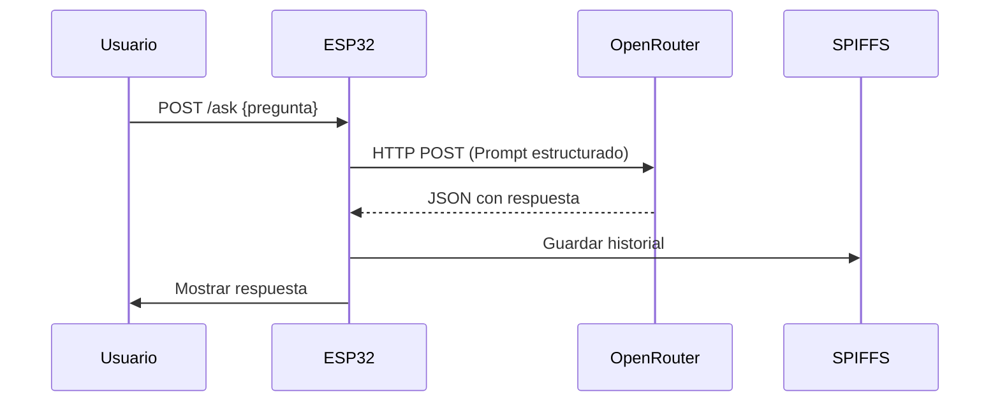
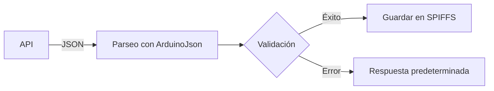
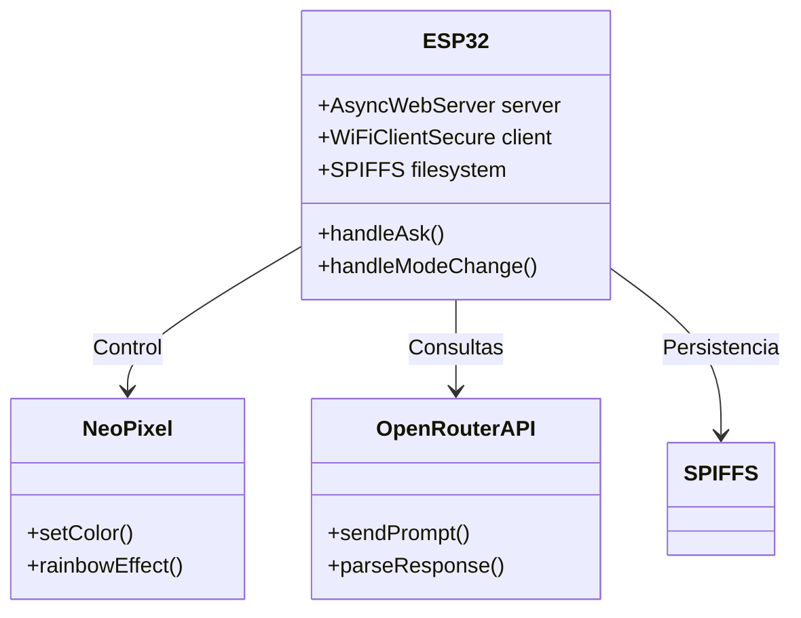
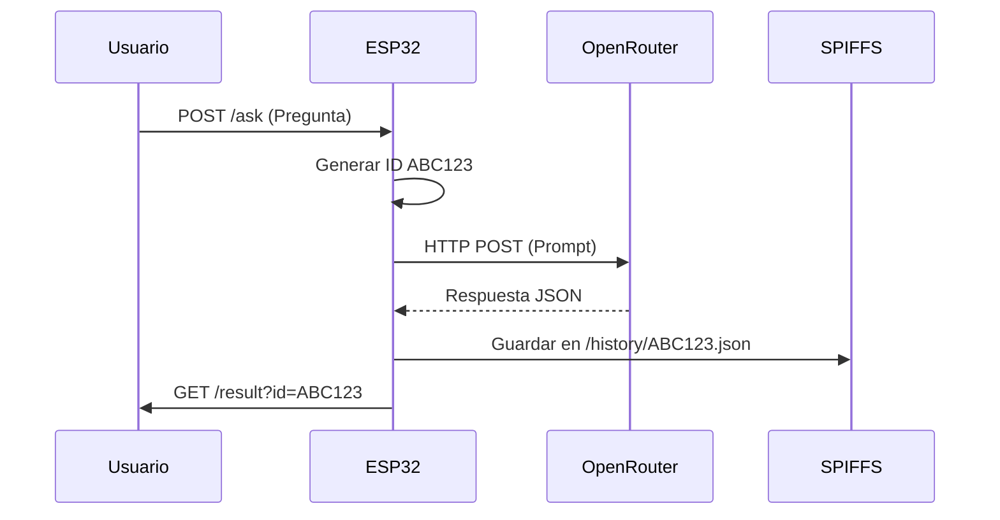

### **1. Diagrama General de la Arquitectura Completa**


---

### **2. Capas del Sistema**  

#### **2.1 Capa de Presentación**  
- **Componentes**:  
  - Interfaz web (HTML/CSS/JS servida desde SPIFFS)  
  - LED NeoPixel (feedback visual)  
- **Protocolos**:  
  - HTTP/HTTPS (puerto 80)  
  - mDNS (`esp32.local`)  

#### **2.2 Capa de Lógica de Negocio**  


#### **2.3 Capa de Persistencia**  
| Componente  | Tecnología | Uso                              | Tamaño Máximo |
|-------------|-----------|----------------------------------|---------------|
| Historial   | SPIFFS    | Almacena últimas 50 consultas    | 1.5MB         |
| Configuración| JSON     | Guarda modo (docente/estudiante) | 10KB          |

---

### **3. Flujo de Datos Detallado**  

#### **3.1 Consulta a la IA**  
1. **Paso 1**: Cliente envía pregunta via POST `/ask`  
   ```json
   {"question":"¿Cómo enseñar el ciclo del agua?"}
   ```
2. **Paso 2**: ESP32:  
   - Genera ID único (`ABC123`)  
   - Almacena en `pendingRequests`  
   - Llama a la API:  
   ```cpp
   http.POST("{\"model\":\"...\",\"messages\":[...]}");
   ```
3. **Paso 3**: Procesamiento:  
   - LED → Efecto arcoíris  
   - Timeout: 15 segundos  

#### **3.2 Respuesta**  


---

### **4. Diagrama de Componentes**  


---

### **5. Comunicación entre Componentes**  

#### **5.1 Secuencia API**  
```python
# Pseudocódigo
def procesar_consulta(pregunta):
    prompt = generar_prompt(pregunta, modo_actual)
    respuesta = openrouter.query(
        model="deepseek-r1",
        prompt=prompt,
        max_tokens=500
    )
    if respuesta.valida:
        return formatear_respuesta(respuesta)
    else:
        return respuesta_alternativa()
```

#### **5.2 Estados del LED**  
| Estado              | Color       | Significado                  |
|---------------------|-------------|------------------------------|
| Inicialización      | Violeta/Amarillo | Modo docente/estudiante |
| Consulta en proceso | Arcoíris     | Procesando con IA            |

---

### **6. Decisiones de Diseño Clave**  

#### **6.1 Asincronía**  
- **Problema**: Bloqueo durante consultas HTTP  
- **Solución**:  
  ```cpp
  xTaskCreatePinnedToCore(
    taskConsultaAPI,  // Función
    "API_Task",      // Nombre
    8192,            // Stack size
    (void*)&data,    // Parámetros
    1,               // Prioridad
    NULL,            // Handle
    1                // Core
  );
  ```

#### **6.2 Gestión de Memoria**  
- **Técnicas**:  
  - Pool de buffers JSON (reutilización)  
  - Limpieza agresiva de `pendingRequests`  
  - SPIFFS con rotación automática  

#### **6.3 Seguridad**  
| Capa               | Implementación                     |
|--------------------|------------------------------------|
| Red                | WiFi WPA2                          |
| API                | Claves en código (no recomendado para producción) |
| Web                | CORS restringido                   |

---

### **7. Escalabilidad**  

#### **7.1 Límites Actuales**  
| Recurso            | Límite               | Mitigación                  |
|--------------------|----------------------|-----------------------------|
| RAM                | 20 consultas simultáneas | Limpieza periódica       |
| Almacenamiento     | 100 consultas históricas | Compresión JSON         |
| API OpenRouter     | 20 req/min (free)    | Cola de priorización       |

#### **7.2 Arquitectura Futura**  


---

### **8. Documentación Técnica Adicional**  

#### **8.1 Estructura de Directorios**  
```
/spiffs/
├── /web/           # Interfaz
├── /history/       # Consultas
└── /config.json    # Ajustes
```

#### **8.2 Rendimiento**  
| Métrica               | Valor            |
|-----------------------|------------------|
| Tiempo respuesta API  | 2.5s (promedio)  |
| Uso RAM máximo        | 65%              |
| Consumo energía       | 180mA @5V        |

---

### **9. Diagrama de Secuencia Completo**  


---

Esta documentación cubre:  
✅ Arquitectura multicapa  
✅ Flujos de datos críticos  
✅ Decisiones técnicas clave  
✅ Plan de escalabilidad  

¿Necesitas que profundice en algún componente específico? Por ejemplo:  
- 🔌 Diagrama detallado de conexiones físicas  
- 🔍 Análisis de seguridad profundo  
- 📈 Métricas de rendimiento extendidas
