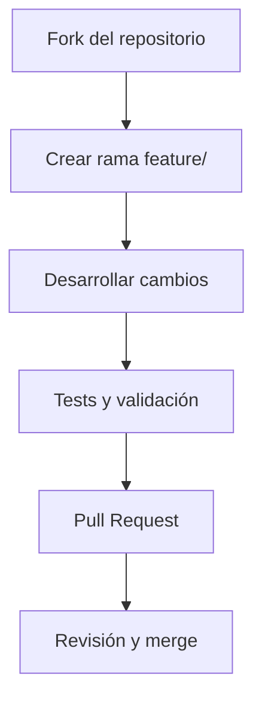

## ** Código de Conducta**

Al participar en este proyecto, aceptas mantener un ambiente respetuoso e inclusivo. 

**Ejemplos de comportamiento inaceptable:**
- Comentarios despectivos sobre nivel educativo o experiencia
- Uso de lenguaje excluyente
- Discriminación por cualquier motivo

---

## ** ¿Cómo Contribuir?**

### **Flujo de Trabajo**


### **Pasos Detallados:**
1. **Haz fork del repositorio**
2. **Clona tu fork**:
   ```bash
   git clone https://github.com/tu-usuario/proyecto-esp32-educativo.git
   cd proyecto-esp32-educativo
   ```

3. **Crea una rama descriptiva**:
   ```bash
   git checkout -b feature/nombre-funcionalidad
   # o
   git checkout -b fix/descripcion-error
   ```

4. **Desarrolla tus cambios** (sigue los estándares de código)

5. **Haz commit de tus cambios**:
   ```bash
   git commit -m "feat: añadir soporte para sensor táctil"
   ```

6. **Haz push a tu fork**:
   ```bash
   git push origin feature/nombre-funcionalidad
   ```

7. **Abre un Pull Request** hacia la rama `ultima'version` del repositorio principal


---

### **Documentación**
```cpp
/**
 * @brief Controla el LED NeoPixel según el modo actual
 * @param mode Modo de operación ("docente" o "estudiante")
 * @return void
 * @note Actualiza el color global del LED
 */
void updateModeLED(String mode) {
  // Implementación...
}
```

### **Formato**
Usa `clang-format` con el archivo de configuración incluido:
```bash
pio run -t format
```

---

## ** Proceso de Pull Requests**

### **Requisitos para PRs:**
- [ ] El código compila sin warnings
- [ ] Los tests pasan correctamente
- [ ] La documentación está actualizada
- [ ] Sigue los estándares de código
- [ ] Incluye descripción clara de los cambios

### **Plantilla de PR:**
```markdown
## Descripción
[Explica qué cambios introduces y por qué]

## Tipo de cambio
- [ ] Corrección de error
- [ ] Nueva funcionalidad
- [ ] Cambio breaking
- [ ] Documentación

## Screenshots (si aplica)
[Incluye capturas del funcionamiento]

## Checklist
- [ ] He probado en hardware real (ESP32)
- [ ] He actualizado la documentación
- [ ] No he introducido nuevos warnings
```

---

## ** Reportar Errores**

Usa la plantilla de issues:
```markdown
## Descripción del error
[Explica claramente qué sucede]

## Pasos para reproducir
1. Abrir endpoint '/ask'
2. Enviar JSON con...
3. Ver error 500

## Comportamiento esperado
[Qué debería suceder]

## Capturas o logs
[Incluye output del monitor serial si es relevante]
```

