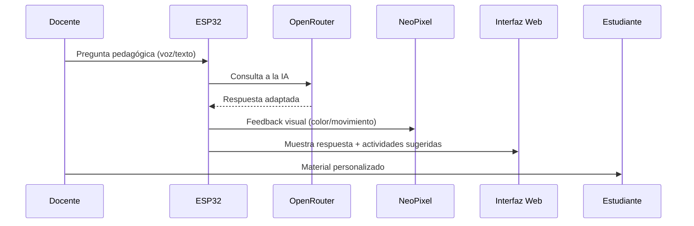

# Avance Preliminar ExpoCENFO # 

---

### **1. Información del Proyecto**  
- **Nombre:** *AI Asistente Educativo Inclusivo con ESP32*  
- **Equipo:** Fiorela Perez, Mariana Cubero, Sharon Castro y Yuliana González.
  - **Roles:**    
             - Fiorela Perez: Desarrollo del backend y frontend.   
             - Mariana Cubero: Coordinadora, encargada de realizar objetos para decoracion en el Maker Space.   
             - Sharon Castro: Encargada de buscar ideas para decoracion el dia de la exposicion.   
             - Yuliana González: Creación de la documentación en GitHub.
---

### **2. Descripción y Justificación**  

#### **Problema que se aborda:**  
Los docentes que trabajan con estudiantes que requieren adecuaciones curriculares significativas (ej: discapacidad cognitiva, autismo) o no significativas (ej: ajustes en ritmo o formato) enfrentan desafíos clave:  
1. **Falta de tiempo** para crear material adaptado a cada necesidad.  
2. **Dificultad para explicar conceptos** de manera personalizada dentro del mismo grupo.  
3. **Limitaciones de recursos** pedagógicos inclusivos listos para usar.  

Al permitir que el docente consulte a la IA directamente desde una interfaz física o web, se optimiza el tiempo de planificación, se fomenta la personalización del material y se promueve una participación más equitativa dentro del grupo. Esto contribuye a:
- Responder rápidamente a dudas pedagógicas específicas.
- Generar explicaciones, ejemplos y actividades según las necesidades del estudiante.
- Alinear el contenido que se trabaja en clase de manera que todo el grupo avance en los mismos temas, respetando los ritmos individuales.
- Promover la autonomía del docente en la creación de recursos sin depender de repositorios externos o procesos de búsqueda extensos.

---

#### **Importancia y contexto:**  
- **Educación inclusiva real:** Cumple con lo establecido en la Ley 7600 (Costa Rica) y los Objetivos de Desarrollo Sostenible (ODS 4).  
- **Brecha tecnológica:** Muchas herramientas educativas con IA son costosas o requieren internet estable; este sistema funciona **offline** parcialmente y con hardware económico.  
- **Empoderamiento docente:** Reduce la dependencia de manuales genéricos o búsquedas extensas en internet.  

**Ejemplo de impacto:**  
Un docente puede preguntar: *"¿Cómo enseñar los volcanes a un estudiante con TEA?"* y recibir:  
- Una explicación con lenguaje claro y apoyo visual.  
- Una actividad sensorial (ej: maqueta con texturas).  
- Un juego de asociación para el grupo.  

---

#### **Usuarios/beneficiarios:**  
| Grupo | Beneficio |  
|-------|----------|  
| **Docentes de educación especial** | Generan material adaptado sin dedicar horas extra. |  
| **Docentes de aulas regulares** | Atienden la diversidad sin retrasar al grupo. |  
| **Estudiantes con adecuaciones** | Reciben contenido accesible a sus necesidades. |  
| **Comunidad educativa** | Promueve inclusión con herramientas concretas. |  

**Caso concreto:**  
- **Escuela rural sin recursos:** El asistente funciona con WiFi básico o modo offline, llevando IA pedagógica a contextos con limitaciones tecnológicas.  

--- 

### **2. Público Meta y Propósito Educativo**  
#### **Beneficiarios Directos:**  
- **Docentes** de educación regular o especial que requieran:  
  - Generar material adaptado a adecuaciones significativas (ej: estudiantes con discapacidad cognitiva).  
  - Crear actividades paralelas para adecuaciones no significativas (ej: ajustes en tiempo o formato).  
- **Estudiantes** con necesidades educativas diversas, promoviendo su participación en el mismo tema de clase con recursos personalizados.  

#### **Objetivos Educativos:**  
| Propósito | Implementación Técnica |  
|-----------|------------------------|  
| **Generar material adaptado** | IA contextualiza respuestas (ej: simplificar lenguaje o proponer ejemplos táctiles). |  
| **Optimizar tiempo docente** | Interfaz física/web para consultas rápidas (sin búsquedas manuales). |  
| **Equidad en el aula** | Mismo tema para todos con variaciones en profundidad/complejidad. |  
| **Autonomía del docente** | Respuestas instantáneas sin depender de repositorios externos. |  

---

### **3. Requisitos Adaptados**  
#### **Funcionales:**  
1. **Modo Docente:**  
   - Consultas pedagógicas (ej: *"¿Cómo explicar fracciones a un estudiante con TEA?"*).  
   - Generador de actividades diferenciadas (ej: *"3 ejercicios de suma con apoyo visual"*).  
2. **Modo Estudiante:**  
   - Explicaciones con lenguaje simple y emojis.  
   - Mini-juegos para reforzar aprendizajes (ej: memoria de conceptos).  
3. **Señales Visuales:**  
   - NeoPixel:  
     - **Violeta:** Modo docente activo.  
     - **Amarillo:** Modo estudiante.  
     - **Arcoíris:** Procesando consulta.  

#### **No Funcionales:**  
- **Offline:** Respuestas predefinidas para términos pedagógicos comunes (ej: inclusión, TDAH).  
- **Accesibilidad:** Compatibilidad con lectores de pantalla en la interfaz web.  

---

### **4. Diseño Preliminar Actualizado**  
#### **Flujo de Uso:**  


#### **Componentes Clave:**  
- **Base de Datos Offline:**  
  - Almacena respuestas para términos frecuentes (ej: *"ejercicios sensoriales"*).  
- **API OpenRouter:**  
  - Modelo *DeepHermes* (optimizado para pedagogía y lenguaje simple).  
- **Interfaz Física:**  
  - Botón para alternar entre modos + micrófono opcional.  

---

### **5. Prototipos Conceptuales**  
#### **Ejemplo de Consulta Docente:**  
```python
# Pregunta: "Actividades para enseñar el ciclo del agua a un estudiante con discapacidad visual"
Respuesta IA:
1. Usar texturas (ej: algodón para nubes, gel frío para lluvia).
2. Relato sonoro con efectos de agua.
3. Maqueta 3D con piezas movibles.
```  
**Señal NeoPixel:** Parpadeo azul al generar actividades.  

#### **Ejemplo de Interfaz Web:**  
  
*(Captura: Panel con opciones para "simplificar explicación" o "generar ejercicio práctico")*  

---

### **6. Plan de Trabajo con Enfoque Inclusivo**  
| Hito | Actividades |  
|------|------------|  
| **Validación con Docentes** | Talleres para probar consultas pedagógicas reales. |  
| **Pruebas de Accesibilidad** | Evaluar interfaz con estudiantes con discapacidad. |  
| **Optimización Offline** | Ampliar base de datos de respuestas predefinidas. |  

#### **Riesgos:**  
- **Baja conectividad en escuelas:** Mitigación con modo offline robusto.  
- **Respuestas no contextualizadas:** Mitigación con *prompt engineering* para educación especial.  

--- 

**Nota:** Este proyecto prioriza la **inclusión real** mediante tecnología accesible y centrada en el docente como facilitador.
